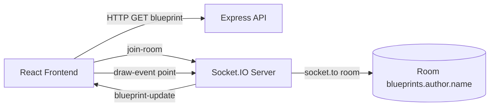
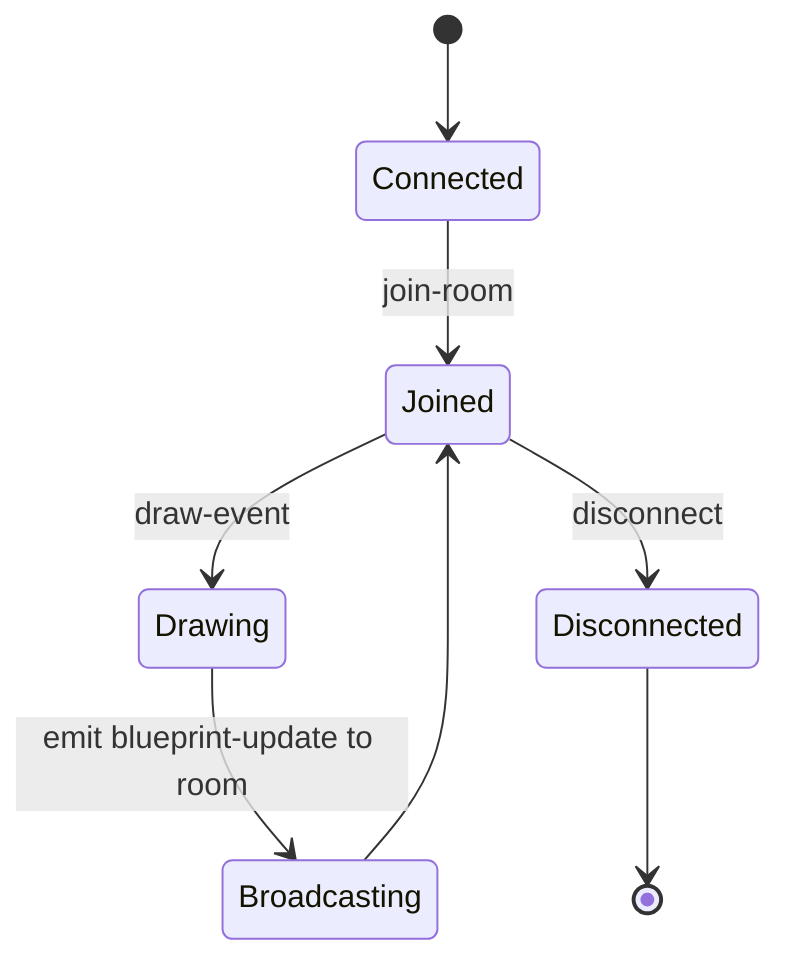

# Socket.IO Backend - High-Impact README Edition

<div align="center">


Blueprint room-based realtime backend used by the Lab P4 front-end.

</div>

---

## Table of contents

- [Purpose](#purpose)
- [What it provides](#what-it-provides)
- [Architecture](#architecture)
- [Events](#events)
- [Run guide](#run-guide)
- [Quality checks](#quality-checks)
- [Screenshot evidence kit](#screenshot-evidence-kit)
- [Frontend integration](#frontend-integration)

---

## Purpose

This backend demonstrates the Socket.IO collaboration model for BluePrints:

- isolate users by blueprint room
- emit point-level updates
- broadcast updates to all peers in the same room

---

## What it provides

- `GET /api/blueprints/:author/:name` for initial blueprint state
- Socket room subscription with `join-room`
- incremental drawing propagation with `draw-event`
- room broadcast through `blueprint-update`

---

## Architecture



### Runtime state flow



---

## Events

### join-room

```json
"blueprints.juan.blueprint-1"
```

### draw-event

```json
{
  "room": "blueprints.juan.blueprint-1",
  "author": "juan",
  "name": "blueprint-1",
  "point": { "x": 140, "y": 88 }
}
```

### blueprint-update

```json
{
  "author": "juan",
  "name": "blueprint-1",
  "points": [{ "x": 140, "y": 88 }]
}
```

---

## Run guide

```bash
npm install
npm run dev
```

Default server: `http://localhost:3001`

Endpoint smoke test:

```bash
curl http://localhost:3001/api/blueprints/juan/blueprint-1
```

---

## Quality checks

```bash
npm run lint
```

---

## Screenshot evidence kit

| File name | Recommended capture |
|---|---|
| `socketio-01-server-start.png` | Terminal showing backend start and listening port |
| `socketio-02-room-join-log.png` | Console proof of room join |
| `socketio-03-draw-event-log.png` | Emitted draw-event payload |
| `socketio-04-broadcast-update-log.png` | Broadcast blueprint-update payload |
| `socketio-05-two-tabs-replication.png` | Two tabs with same room and synchronized drawing |
| `socketio-06-sonar-and-lint-pass.png` | Sonar workflow + lint passing status |

---

## Frontend integration

In front-end `.env.local`:

```bash
VITE_IO_BASE=http://localhost:3001
```

Select transport mode: **Socket.IO (Node)**.

---

## License

MIT [LICENSE](LICENSE)
