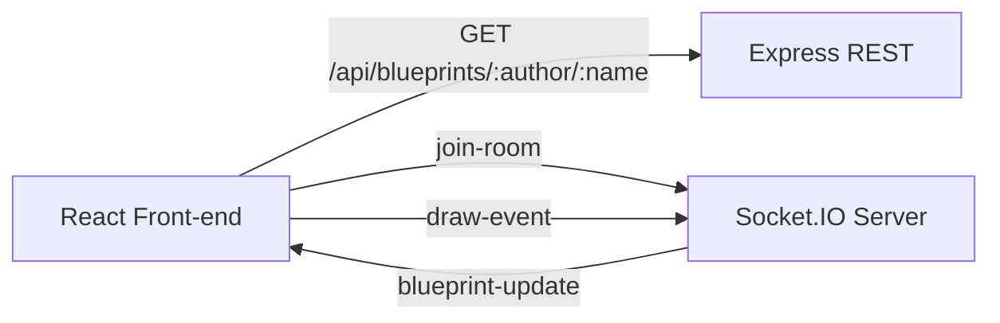
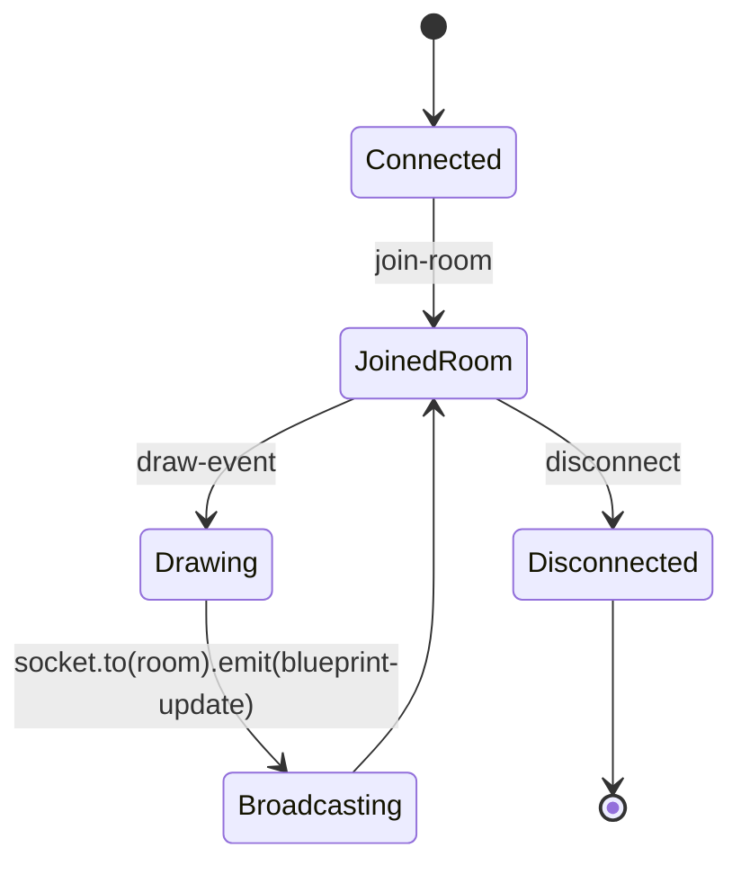

# Socket.IO Backend for BluePrints Real-Time Collaboration

<div align="center">


Reference real-time backend used by the P4 front-end to support multi-user collaborative drawing.

</div>

---

## What this backend provides

- Minimal REST endpoint for initial blueprint loading.
- Socket.IO room-based collaboration per blueprint.
- Broadcast strategy for incremental drawing (`point` events).

---

## Architecture



### Event lifecycle



---

## Event contracts

- `join-room`
  - Payload: `blueprints.{author}.{name}`
- `draw-event`
  - Payload:

```json
{
  "room": "blueprints.juan.blueprint-1",
  "author": "juan",
  "name": "blueprint-1",
  "point": { "x": 130, "y": 84 }
}
```

- `blueprint-update`
  - Payload:

```json
{
  "author": "juan",
  "name": "blueprint-1",
  "points": [{ "x": 130, "y": 84 }]
}
```

---

## Run locally

```bash
npm install
npm run dev
```

Server default: `http://localhost:3001`

Test initial state endpoint:

```bash
curl http://localhost:3001/api/blueprints/juan/blueprint-1
```

---

## Quality commands

```bash
npm run lint
```

---

## Screenshot evidence suggestions

Use these captures in your README/report:

1. `socketio-01-server-running.png`
   - Terminal showing `Socket.IO up on :3001`.
2. `socketio-02-room-join-and-broadcast.png`
   - Browser devtools logs with room join + broadcast update.
3. `socketio-03-two-tabs-sync.png`
   - Two tabs drawing same blueprint with replicated points.
4. `socketio-04-sonar-ci-pass.png`
   - GitHub Actions/SonarCloud successful pipeline.

---

## Integration with P4 front-end

Set in front-end `.env.local`:

```bash
VITE_IO_BASE=http://localhost:3001
```

Then in the UI select `Socket.IO (Node)` transport.

---

## License

MIT [LICENSE](LICENSE)
