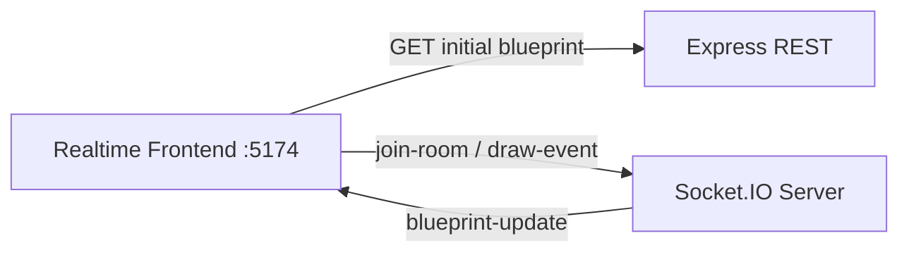

# ⚡ Socket.IO Backend - Final Evidence README

<div align="center">


Realtime room-based backend used by the central P4 frontend.

</div>

---

## 🎯 Purpose

This backend is responsible for Socket.IO collaborative behavior:

- join blueprint-specific rooms
- receive draw events
- broadcast updates to room peers

---

## 🧩 Core contracts

- `join-room` → `blueprints.{author}.{name}`
- `draw-event` → `{ room, author, name, point }`
- `blueprint-update` → `{ author, name, points: [...] }`
- REST bootstrap endpoint: `GET /api/blueprints/:author/:name`

---

## 🏗️ Architecture



---

## ▶️ Run

```bash
npm install
npm run dev
```

Service URL: `http://localhost:3001`

Quick check:

```bash
curl http://localhost:3001/api/blueprints/juan/blueprint-1
```

---

## 📸 Evidence gallery

### 01 - Server started
Backend runtime confirmed on expected port.


### 02 - Room join log
Client enters expected collaboration room.


### 03 - Draw-event payload
Outgoing realtime event from frontend to Socket.IO server.


### 04 - Broadcast update payload
Server emits update to all peers in the same room.


### 05 - Two-tab replication
Visual proof of synchronized drawing between tabs.


### 06 - CI/quality evidence
Lint and Sonar pipeline passing.


---

## 🔗 Integration note

Set this in realtime frontend `.env.local`:

```bash
VITE_IO_BASE=http://localhost:3001
```

---

## 📄 License

MIT [LICENSE](LICENSE)
