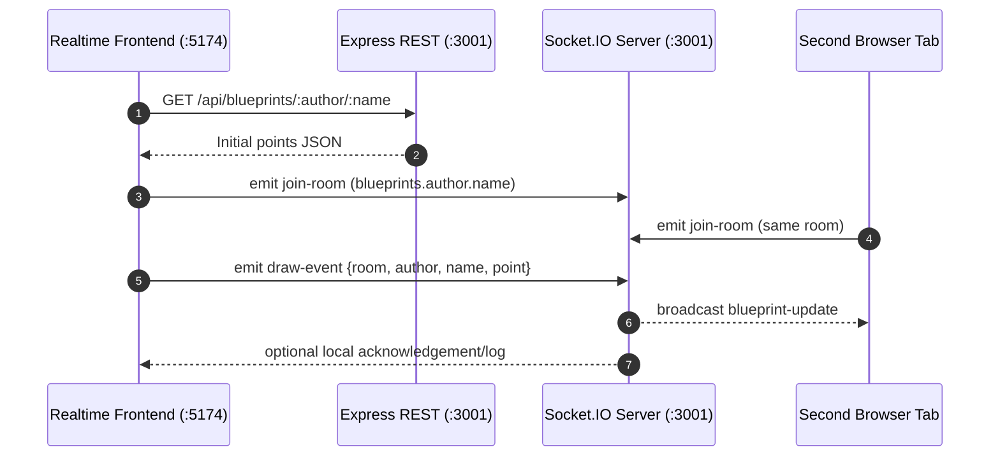
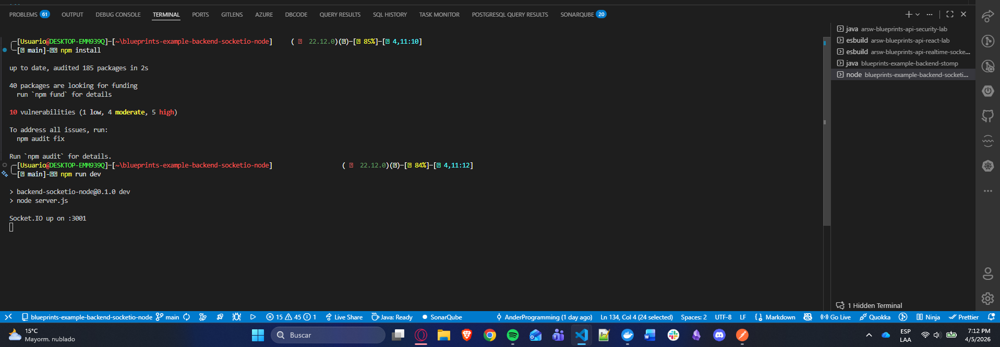
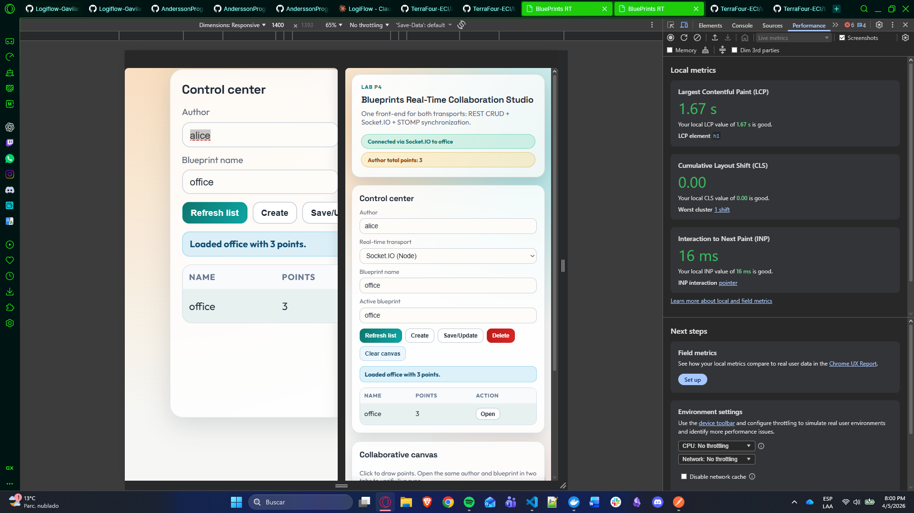
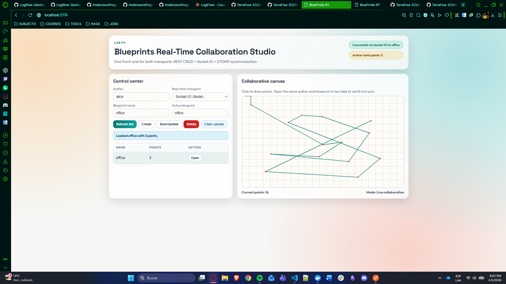
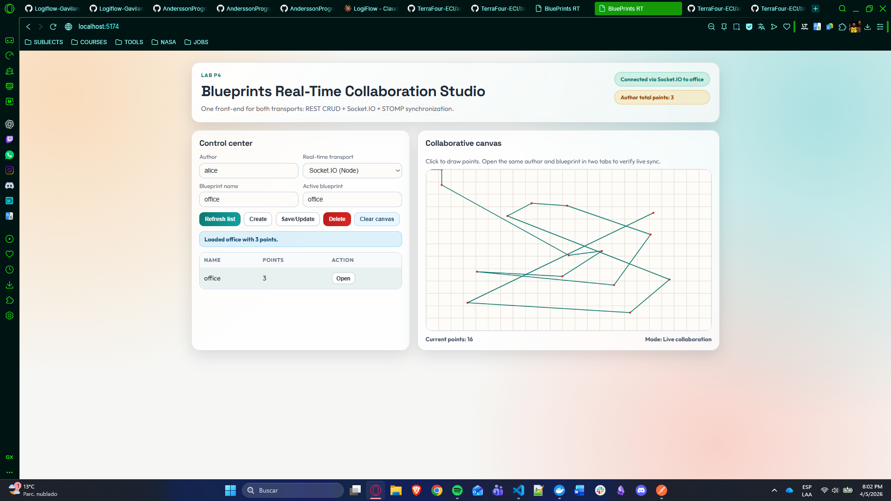
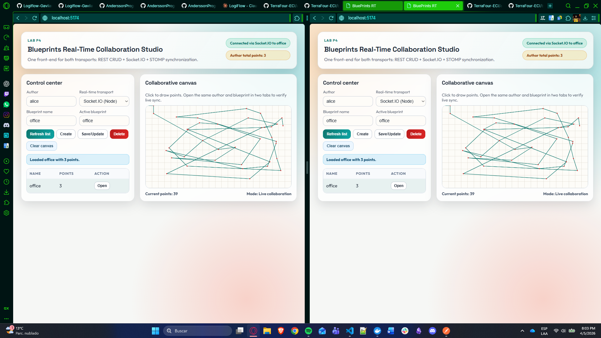
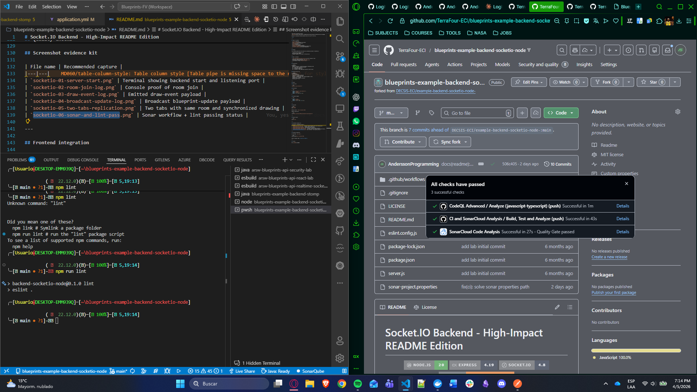

# Socket.IO Backend for BluePrints P4

**Goal:** understand, document, and run a **Node.js + Socket.IO** backend that enables realtime collaboration for blueprint drawing and integrates with the **React BluePrints P4 frontend**.

<div align="center">


</div>

---

## 🧩 What this backend solves

- Minimal REST API for **initial blueprint state**.
- **Realtime collaboration** with Socket.IO:
  - Join author/blueprint rooms.
  - Send incremental draw points and **broadcast** updates to peers.
- Direct integration with the frontend repository: [TerraFour-ECI/arsw-blueprints-api-realtime-sockets-lab](https://github.com/TerraFour-ECI/arsw-blueprints-api-realtime-sockets-lab).

---

## 🏗️ Architecture summary (Advanced Mermaid)



**Conventions**
- **Room:** `blueprints.{author}.{name}`
- **Client -> server events:**
  - `join-room` -> `room`
  - `draw-event` -> `{ room, author, name, point:{x,y} }`
- **Server -> clients event:**
  - `blueprint-update` -> `{ author, name, points:[{x,y}] }`

---

## 📦 Requirements

- Node.js **v18+** (recommended **v20 LTS**)
- npm or pnpm

---

## 🚀 Getting started

```bash
# 1) Install dependencies
npm i

# 2) Run in development mode
npm run dev
# HTTP: http://localhost:3001
# Socket.IO: same host/port
```

> **Port:** default is **3001**. You can override with `PORT`.

---

## 🔌 REST endpoint (minimum)

Used by the frontend to load the initial blueprint before realtime drawing starts.

- **GET** `/api/blueprints/:author/:name`

Example response:

```json
{
  "author": "juan",
  "name": "plano-1",
  "points": [{ "x": 10, "y": 10 }, { "x": 40, "y": 50 }]
}
```

Quick test:

```bash
curl http://localhost:3001/api/blueprints/juan/plano-1
```

> This repository focuses on realtime behavior. Full CRUD (POST/PUT/DELETE/list) is handled by the course API.

---

## 🔴 Socket.IO event flow

### 1) Join room

**Client -> server**

```js
socket.emit('join-room', `blueprints.${author}.${name}`)
```

### 2) Send point (incremental drawing)

**Client -> server**

```js
socket.emit('draw-event', {
  room: `blueprints.${author}.${name}`,
  author,
  name,
  point: { x, y }
})
```

**Server -> clients (room broadcast)**

Event: `blueprint-update`

```json
{
  "author": "juan",
  "name": "plano-1",
  "points": [{ "x": 123, "y": 45 }]
}
```

---

## 🧪 Frontend integration (P4)

In the realtime frontend repo ([TerraFour-ECI/arsw-blueprints-api-realtime-sockets-lab](https://github.com/TerraFour-ECI/arsw-blueprints-api-realtime-sockets-lab)), set:

```bash
VITE_API_BASE=http://localhost:8080   # secured CRUD API (security-lab)
VITE_IO_BASE=http://localhost:3001    # this Socket.IO backend
```

Related repositories in the integrated flow:
- JWT frontend: [TerraFour-ECI/arsw-blueprints-api-react-lab](https://github.com/TerraFour-ECI/arsw-blueprints-api-react-lab) (`5173`)
- Security backend: [TerraFour-ECI/arsw-blueprints-api-security-lab](https://github.com/TerraFour-ECI/arsw-blueprints-api-security-lab) (`8080`)

Then:
1. Start this backend.
2. Start frontend.
3. Select **Socket.IO** in the RT selector.
4. Open two tabs on the same author/blueprint.
5. Draw and verify near realtime replication.

---

## ⚙️ Configuration

Environment variables:
- `PORT` (optional): server port, default `3001`.
- `CORS_ORIGINS` (optional): comma-separated allowed origins; use `*` only for local dev.
- `JWT_REQUIRED` (optional): defaults to `true`; when enabled, socket handshake requires Bearer token.
- `JWT_ENFORCE_ROOM_OWNER` (optional): defaults to `true`; user can only join/publish for their own author room unless admin.
- `SECURITY_API_BASE` (optional): defaults to `http://localhost:8080` for remote token validation.
- `JWT_ADMIN_USERS` (optional): comma-separated usernames that can access any room.

Scripts:

```json
{
  "scripts": {
    "dev": "node server.js",
    "lint": "eslint .",
    "test": "node --test"
  }
}
```

---

## 🧪 Automated JWT Authorization Tests

This repository now includes automated realtime authorization tests at `test/jwt-rt-auth.test.js`.

Covered cases:
- ✅ Valid JWT: authorized room join + successful realtime broadcast.
- ✅ Invalid JWT: handshake rejected with `connect_error`.
- ✅ Foreign author access: user is rejected when joining another author's room.

Run tests:

```bash
npm test
```

---

## 🔐 CORS and security

- Development: permissive CORS can simplify setup.
- Production: restrict allowed origins.

```js
const allowed = ['https://your-frontend.example.com']
const io = new Server(server, { cors: { origin: allowed } })
```

Recommended hardening:
- Validate payloads (zod/joi).
- Add authentication and room-level authorization (JWT).

### How this was implemented in this repository
- Payload validation for realtime events is implemented in `server.js` (`isValidPoint` and `isValidDrawEvent`).
- CORS policy is configurable via `CORS_ORIGINS` (`parseAllowedOrigins`), allowing strict production origins.
- Basic observability is implemented with structured logs for connect, join-room, draw-event, and disconnect.
- Health check endpoint is available at `GET /health`.
- Latency hook is implemented with `ping-check` -> `pong-check` socket events.
- JWT handshake authorization is implemented with Socket.IO middleware (`io.use(...)`) and Bearer extraction.
- Token validity is enforced by calling the security backend (`SECURITY_API_BASE/api/blueprints`) before accepting socket connection.
- Room/topic ownership enforcement is implemented in `join-room` and `draw-event` handlers.

---

## 📚 Suggested Extensions

- **Persistence**
  - Why: current REST seed response is static and does not persist collaborative edits.
  - How to extend: write incoming points to Redis/PostgreSQL and load from storage in `GET /api/blueprints/:author/:name`.
- **Scalability**
  - Why: room broadcasts are in-memory per Node process.
  - How to extend: add Socket.IO Redis adapter for multi-instance pub/sub synchronization.
- **Metrics**
  - Why: rubric values observability and diagnosis of latency/reconnect behavior.
  - How it is already partially implemented: connection/join/draw/disconnect logs plus ping/pong hook.
  - Next step: export metrics to Prometheus/Grafana.
- **Security**
  - Why: production should restrict who can publish to each blueprint room.
  - How it is currently supported: CORS is configurable, payload shape is validated, JWT handshake is required, and room-level authorization is enforced.
  - Next step: move from remote API validation to direct JWK verification and add role-based permissions for cross-author collaboration policies.

---

## 🩺 Troubleshooting

- **Frontend blank page:** check browser console and frontend Vite setup.
- **No broadcast:** verify both tabs joined the **same room** and server uses room broadcasting.
- **CORS blocked:** allow your frontend origin in backend CORS settings.
- **Socket.IO connection issues:** force WebSocket in client `{ transports: ['websocket'] }`.

---

## 📸 Evidence gallery

### 01 - Server startup
Backend running on expected port.



### 02 - Room join log
Client successfully joined the collaboration room.



### 03 - Draw event payload
Point payload received from frontend.



### 04 - Broadcast update payload
Server broadcast to room peers.



### 05 - Two-tab replication
Visual synchronization between browser tabs.



### 06 - Quality evidence
Lint and Sonar checks passing.



---

## ✅ Delivery checklist

- ✅ `GET /api/blueprints/:author/:name` returns initial points.
- ✅ Clients join `room = blueprints.{author}.{name}`.
- ✅ `draw-event` triggers `blueprint-update` broadcast to the room.
- ✅ Frontend reflects remote drawing in **< 1s** in 2+ tabs.
- ✅ Team lab document explains setup and frontend integration.

> 🎉 **Status:** all mandatory checklist items are completed.

---

## 📄 License

MIT [LICENSE](LICENSE)
